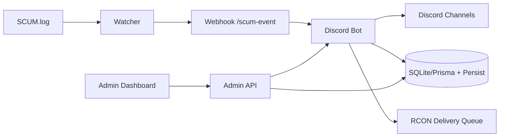

# SCUM TH Bot
Discord + SCUM Server Operations Platform


ระบบบอท Discord สำหรับเซิร์ฟเวอร์ SCUM ที่รวม Economy, Shop, Auto Delivery, Ticket, Admin Web และ Observability ไว้ในโปรเจกต์เดียว

เอกสารสถานะเชิงลึก: [PROJECT_HQ.md](./PROJECT_HQ.md)

---

## ฟีเจอร์หลัก

- Economy + Wallet + Daily/Weekly
- Shop + Cart + Purchase + Inventory
- Auto Delivery ผ่าน RCON queue (retry + dead-letter + audit + watchdog)
- Rent Bike รายวัน (1 ครั้ง/วัน/คน + reset/cleanup)
- Ticket / Event / Bounty / Giveaway / VIP / Redeem
- Kill feed แบบ realtime (weapon + distance + hit-zone)
- Admin Web (RBAC owner/admin/mod, login จาก DB, backup/restore, live updates)
- Player Portal Web แยก (`/player`) สำหรับผู้เล่น (dashboard + shop + inventory + quick actions)
- Observability (metrics time-series, ops alerts, `/healthz`)

---

## สถาปัตยกรรมย่อ



---

## Quick Start

### ติดตั้งแบบง่าย (Windows, แนะนำ)

รันครั้งเดียวที่โฟลเดอร์โปรเจกต์:

```bash
npm run setup:easy
```

หรือดับเบิลคลิกไฟล์ `setup-easy.cmd`

สคริปต์จะทำให้:

- สร้าง `.env` อัตโนมัติจาก `.env.example` ถ้ายังไม่มี
- สร้าง `apps/web-portal-standalone/.env` อัตโนมัติถ้ายังไม่มี
- ติดตั้ง dependencies (`npm install`)
- `prisma generate` + `prisma db push`

### 1) ติดตั้ง

```bash
npm install
copy .env.example .env
```

### 2) ตั้งค่า `.env`

ค่าจำเป็นขั้นต่ำ:

- `DISCORD_TOKEN`
- `DISCORD_CLIENT_ID`
- `DISCORD_GUILD_ID`
- `SCUM_LOG_PATH`
- `SCUM_WEBHOOK_SECRET`
- `DATABASE_URL` (เช่น `file:./prisma/dev.db`)

### 3) ลงทะเบียน slash commands

```bash
npm run register-commands
```

### 4) รันระบบ

Terminal 1:

```bash
npm start
```

Terminal 2:

```bash
node scum-log-watcher.js
```

Admin Web:

- `http://127.0.0.1:3200/admin/login`

### โหมดแยก process (แนะนำ production)

1. Bot process:

```bash
npm run start:bot
```

2. Worker process:

```bash
npm run start:worker
```

3. SCUM watcher:

```bash
node scum-log-watcher.js
```

4. Web portal แยก:

```bash
npm run start:web-standalone
```

ตัวอย่างไฟล์ PM2 สำหรับรันครบชุดอยู่ที่:

- [deploy/pm2.ecosystem.config.cjs](./deploy/pm2.ecosystem.config.cjs)

รันด้วย PM2:

```bash
pm2 start deploy/pm2.ecosystem.config.cjs
pm2 status
pm2 logs scum-bot
```

---

## การทดสอบ

รันชุดตรวจทั้งหมด:

```bash
npm run check
npm run security:check
```

รันเฉพาะเทสต์:

```bash
npm test
```

สถานะล่าสุด: `43/43 passing`

เช็กความพร้อมก่อนปล่อยขึ้นจริง:

```bash
npm run check
npm run security:check
npm run doctor
npm run doctor:web-standalone
npm run doctor:web-standalone:prod
```

---

## สถานะ Data Layer (P2)

ย้ายเป็น Prisma แล้ว:

- `memoryStore` (wallet/shop/purchase)
- `WalletLedger` + `PurchaseStatusHistory`
- `linkStore`
- `bountyStore`
- `statsStore`
- `cartStore`
- `redeemStore`
- `vipStore`
- `scumStore`
- `eventStore`
- `ticketStore`
- `weaponStatsStore`
- `welcomePackStore`
- `moderationStore`
- `giveawayStore`
- `topPanelStore`
- `deliveryAuditStore`
- `playerAccountStore` (`PlayerAccount`)
- `config-overrides` (`BotConfig`)
- `delivery queue` (`DeliveryQueueJob`)
- `delivery dead-letter` (`DeliveryDeadLetter`)

ยังค้างสำหรับ migration เพิ่มเติม:

- ปิด fallback ใน production หลัง migration ครบ (`PERSIST_REQUIRE_DB=true`)

หมายเหตุ: ตอนนี้ `link/bounty/stats/cart/redeem/vip/scum/event/ticket/weaponStats/welcomePack/moderation/giveaway/topPanel/deliveryAudit` ใช้รูปแบบ `in-memory cache + Prisma write-through + startup hydration` เพื่อไม่ให้ API เดิมพัง

---

## ความคืบหน้า Roadmap (ล่าสุด)

- Phase 1 เสร็จ:
  - Data layer migration ส่วน wallet/purchase/cart/redeem/vip/scum/event/ticket/weaponStats/welcomePack/moderation/giveaway/topPanel/deliveryAudit พร้อม migration ใหม่
  - Wallet ledger ครบ audit trail
  - Order/delivery state machine + transition guard + status history
  - Admin security hardening ฝั่ง purchase status API
- Phase 2 เริ่มแล้ว:
  - Player account system (DB model + store)
  - SteamID binding sync อัตโนมัติจาก link store
  - Player dashboard API: `GET /admin/api/player/dashboard?userId=<discordId>`
  - Player accounts API: `GET /admin/api/player/accounts`
  - Player Portal UI แยกที่ `/player` + API เฉพาะผู้เล่น (`/admin/api/portal/*`)
  - Inventory/catalog query-filter สำหรับ player portal
- Phase 3 เริ่มวางฐาน:
  - Shared coin service กลาง (`src/services/coinService.js`)
  - เพิ่ม `src/services/playerOpsService.js` เป็น service กลางสำหรับ `rentbike` + `bounty` + `redeem`
  - ย้าย flow เหรียญหลัก (`add/remove/set/gift/event/refund`) ให้ผ่าน coin service มากขึ้น
  - เพิ่ม worker entrypoint (`src/worker.js`) + runtime split flags + PM2 manifest

---

## Production Checklist (สรุป)

- หมุน secret ทั้งชุดก่อน deploy
  - `DISCORD_TOKEN`, `SCUM_WEBHOOK_SECRET`, `ADMIN_WEB_PASSWORD`, `ADMIN_WEB_TOKEN`, `RCON_PASSWORD`
- ตั้งค่า production security env
  - `NODE_ENV=production`
  - `ADMIN_WEB_SECURE_COOKIE=true`
  - `ADMIN_WEB_HSTS_ENABLED=true`
  - `ADMIN_WEB_ALLOW_TOKEN_QUERY=false`
  - `ADMIN_WEB_ENFORCE_ORIGIN_CHECK=true`
- ถ้าแยก process ตาม Phase 3:
  - Bot: `BOT_ENABLE_ADMIN_WEB=false`, `BOT_ENABLE_RENTBIKE_SERVICE=false`, `BOT_ENABLE_DELIVERY_WORKER=false`
  - Worker: `WORKER_ENABLE_RENTBIKE=true`, `WORKER_ENABLE_DELIVERY=true`
- วาง Admin Web หลัง HTTPS reverse proxy
- รันก่อนปล่อยจริง:
  - `npm run check`
  - `npm run security:check`
  - `npm audit --omit=dev`

---

## Endpoint สำคัญ

- Admin Web: `GET /admin/login`
- Player Portal: `GET /player`
- Admin Observability: `GET /admin/api/observability`
- Live stream: `GET /admin/api/live`
- Player Dashboard API: `GET /admin/api/player/dashboard?userId=<discordId>`
- Portal API (ผ่าน standalone): `/player/api/dashboard`, `/player/api/shop/list`, `/player/api/purchase/list`, `/player/api/redeem`, `/player/api/rentbike/request`
- Health check: `GET /healthz`
- SCUM webhook: `POST /scum-event`

---

## เว็บแยก (Discord OAuth)

มีโปรเจคเว็บแยกจากบอทเดิมแล้วที่:

- `apps/web-portal-standalone/`

จุดประสงค์:

- login ผ่าน Discord OAuth
- แยก process ออกจากบอทหลัก
- ให้เว็บนี้เป็น `player-only` แบบไม่พึ่ง `/admin/api`
- route `/admin*` จะ redirect ไป admin เดิมตาม `WEB_PORTAL_LEGACY_ADMIN_URL`

รันได้ด้วย:

```bash
npm run start:web-standalone
```

ตรวจความพร้อมก่อน deploy:

```bash
npm run doctor:web-standalone
npm run doctor:web-standalone:prod
```

เช็กรายละเอียดและ checklist production:

- [apps/web-portal-standalone/README.md](./apps/web-portal-standalone/README.md)

คู่มือติดตั้งแบบละเอียด:

- [apps/web-portal-standalone/README.md](./apps/web-portal-standalone/README.md)

---

## เอกสารเพิ่มเติม

- สถานะโครงการ + roadmap + changelog: [PROJECT_HQ.md](./PROJECT_HQ.md)
- Incident runbook: [docs/INCIDENT_RESPONSE.md](./docs/INCIDENT_RESPONSE.md)
- Data migration plan: [docs/DATA_LAYER_MIGRATION.md](./docs/DATA_LAYER_MIGRATION.md)

---

## License

ISC
