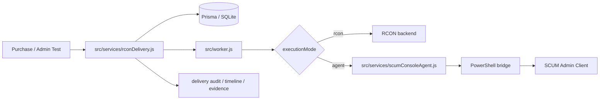
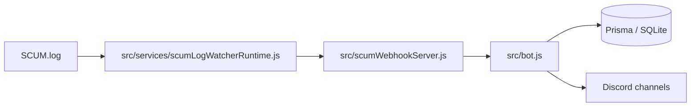
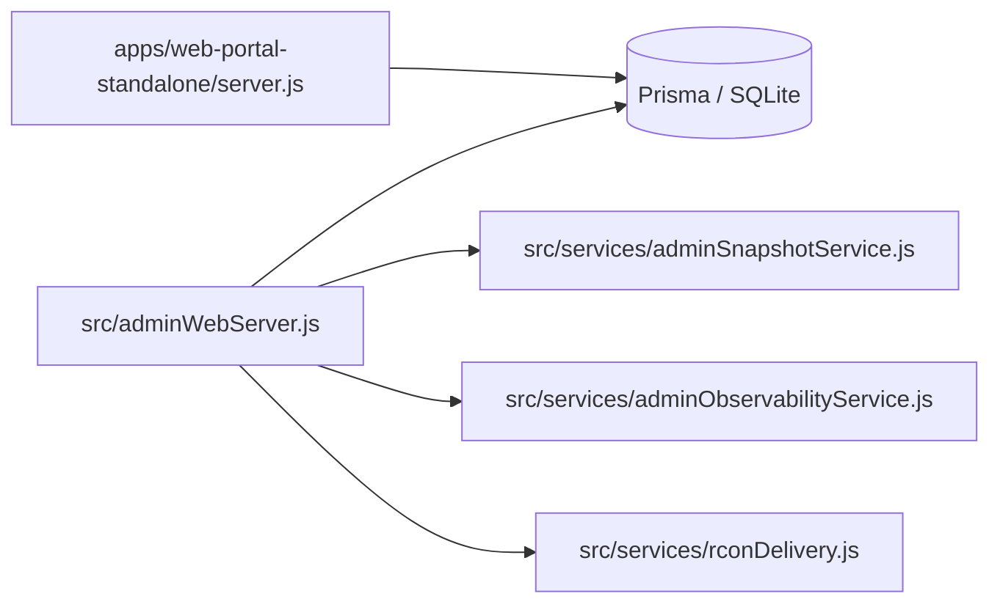

# Architecture Overview

เอกสารนี้อธิบายสถาปัตยกรรมตามไฟล์ที่มีอยู่จริงใน repo ไม่ใช่ภาพเชิงขายของ

ถ้าต้องการสถานะการตรวจล่าสุดให้ดู [docs/VERIFICATION_STATUS_TH.md](./VERIFICATION_STATUS_TH.md)
ถ้าต้องการรายการหลักฐานราย feature ให้ดู [docs/EVIDENCE_MAP_TH.md](./EVIDENCE_MAP_TH.md)

## 1. Runtime Components

| Runtime | Entry file | หน้าที่หลัก | หมายเหตุ |
| --- | --- | --- | --- |
| Discord bot | `src/bot.js` | Discord gateway, command routing, admin web bootstrap, SCUM webhook receiver | control plane หลัก |
| Worker | `src/worker.js` | delivery queue worker, rent bike runtime, background jobs | แยกจาก bot ได้ |
| Watcher | `src/services/scumLogWatcherRuntime.js` | tail `SCUM.log`, parse event, push เข้า webhook | runtime แยกจาก bot |
| Console agent | `src/scum-console-agent.js`, `src/services/scumConsoleAgent.js` | execute command bridge ไป SCUM admin client | ใช้เมื่อ delivery ต้องพึ่ง agent mode |
| Admin web | `src/adminWebServer.js` | admin API, auth, RBAC, backup/restore, observability, delivery tools | mount ผ่าน bot runtime |
| Player portal | `apps/web-portal-standalone/server.js` | player login, wallet, purchase history, shop, redeem, profile | แยก deploy ได้ |

## 2. Delivery Path

ไฟล์หลักที่เกี่ยวข้อง:
- `src/services/rconDelivery.js`
- `src/store/deliveryAuditStore.js`
- `src/store/deliveryEvidenceStore.js`
- `src/services/scumConsoleAgent.js`
- `test/rcon-delivery.integration.test.js`

สิ่งที่ diagram นี้สื่อ:
- order ทุกตัววิ่งผ่าน delivery service กลาง
- backend execution ถูกแยกเป็น `rcon` หรือ `agent`
- audit, timeline, preflight, verification, evidence bundle อยู่ใน delivery path เดียวกัน

สิ่งที่ diagram นี้ไม่ได้สื่อเกินจริง:
- ไม่ได้ยืนยันว่า RCON ใช้ spawn ได้กับทุกเซิร์ฟเวอร์
- ไม่ได้ยืนยันว่า agent mode เป็น game-native API

## 3. Event Ingestion Path

ไฟล์หลักที่เกี่ยวข้อง:
- `src/services/scumLogWatcherRuntime.js`
- `src/scumWebhookServer.js`
- `test/scum-webhook.integration.test.js`

ข้อจำกัดปัจจุบัน:
- path และ format ของ `SCUM.log` ยังเป็น dependency ภายนอก
- ถ้า log format เกมเปลี่ยน ต้องตามแก้ parser/watcher

## 4. Admin / Portal Surface

ไฟล์หลักที่เกี่ยวข้อง:
- `src/adminWebServer.js`
- `src/services/adminSnapshotService.js`
- `src/services/adminAuditService.js`
- `src/services/adminObservabilityService.js`
- `apps/web-portal-standalone/server.js`
- `test/admin-api.integration.test.js`
- `test/web-portal-standalone.player-mode.integration.test.js`

ขอบเขตปัจจุบัน:
- admin web ครอบ operational surface ส่วนใหญ่แล้ว
- player portal แยกจาก admin path แล้ว
- บาง setting ยังต้องแก้ผ่าน env หรือไฟล์ config โดยตรง

## 5. Data Layer

- primary persistence: Prisma + SQLite
- runtime state: in-memory cache + Prisma write-through
- production guard:
  - `PERSIST_REQUIRE_DB=true`
  - `PERSIST_LEGACY_SNAPSHOTS=false`
  - `NODE_ENV=production`

ข้อจำกัดปัจจุบัน:
- SQLite เหมาะกับ single-host / low-concurrency
- multi-tenant foundation มีแล้ว แต่ยังไม่ใช่ isolation แบบแยก database ต่อ tenant
- ถ้าจะโตเป็นหลายเครื่องหลาย worker จริง ควรวางทางย้ายไป PostgreSQL/MySQL

## 6. Health / Readiness Boundaries

health endpoints:
- bot: `http://<BOT_HEALTH_HOST>:<BOT_HEALTH_PORT>/healthz`
- worker: `http://<WORKER_HEALTH_HOST>:<WORKER_HEALTH_PORT>/healthz`
- watcher: `http://<SCUM_WATCHER_HEALTH_HOST>:<SCUM_WATCHER_HEALTH_PORT>/healthz`
- console-agent: `http://<SCUM_CONSOLE_AGENT_HOST>:<SCUM_CONSOLE_AGENT_PORT>/healthz`
- admin web: `http://<ADMIN_WEB_HOST>:<ADMIN_WEB_PORT>/healthz`
- player portal: `http://<WEB_PORTAL_HOST>:<WEB_PORTAL_PORT>/healthz`

สคริปต์ที่ใช้จริง:
- `npm run doctor`
- `npm run doctor:topology:prod`
- `npm run doctor:web-standalone:prod`
- `npm run security:check`
- `npm run readiness:prod`
- `npm run smoke:postdeploy`

## 7. Current Constraints

- `agent mode` ยังพึ่ง Windows session และ SCUM admin client จริง
- `RCON` ใช้เป็น backend ได้ แต่ความสามารถเรื่อง spawn ยังขึ้นกับพฤติกรรมของเซิร์ฟเวอร์ปลายทาง
- restore มี guardrails หลายชั้นแล้ว แต่ยังควรทำใน maintenance window และยังมี manual confirmation
- screenshot dashboard จริงและ demo GIF ยังไม่ได้ถูก track ไว้ใน repo ตอนนี้
