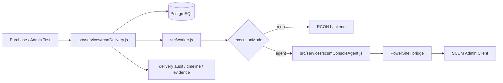
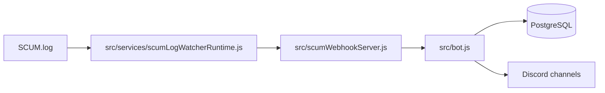
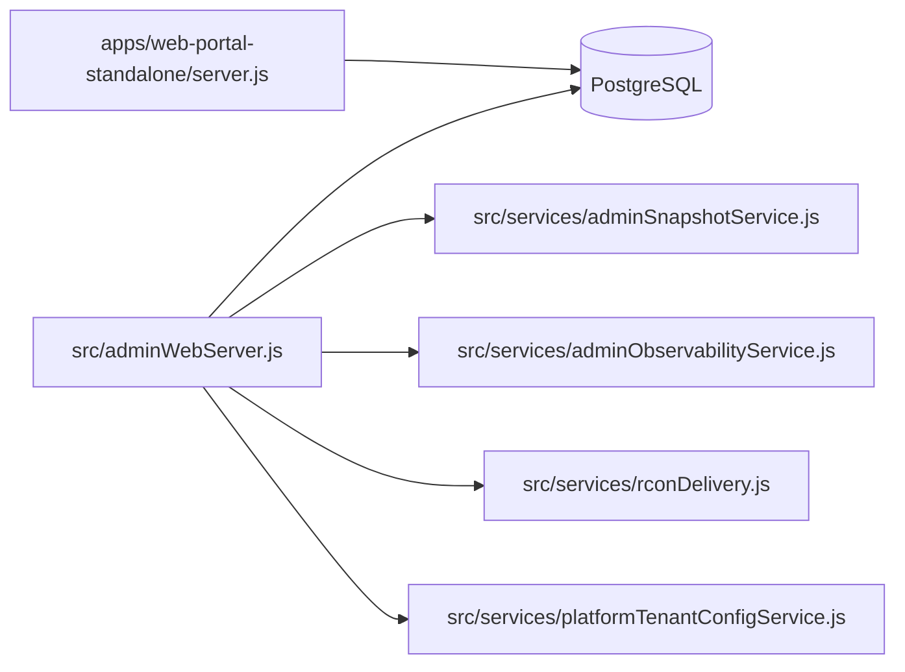

# Architecture Overview

เอกสารนี้อธิบายสถาปัตยกรรมตามไฟล์ที่มีอยู่จริงใน repo

ถ้าต้องการสถานะการตรวจล่าสุดให้ดู [VERIFICATION_STATUS_TH.md](./VERIFICATION_STATUS_TH.md)
ถ้าต้องการหลักฐานราย feature ให้ดู [EVIDENCE_MAP_TH.md](./EVIDENCE_MAP_TH.md)

## 1. Runtime Components

| Runtime | Entry file | หน้าที่หลัก | หมายเหตุ |
| --- | --- | --- | --- |
| Discord bot | `src/bot.js` | Discord gateway, command routing, admin web bootstrap, SCUM webhook receiver | control plane หลัก |
| Worker | `src/worker.js` | delivery queue worker, rent bike runtime, background jobs | แยกจาก bot ได้ |
| Watcher | `src/services/scumLogWatcherRuntime.js` | tail `SCUM.log`, parse event, push เข้า webhook | รายงาน degraded ได้เมื่อ log ไม่พร้อม |
| Console agent | `src/scum-console-agent.js`, `src/services/scumConsoleAgent.js` | execute command bridge ไป SCUM admin client | ใช้เมื่อ delivery ต้องพึ่ง agent mode |
| Admin web | `src/adminWebServer.js` | admin API, auth, RBAC, backup/restore, observability, delivery tools, tenant config | mount ผ่าน bot runtime |
| Player portal | `apps/web-portal-standalone/server.js` | player login, wallet, purchase history, shop, redeem, profile | แยก deploy ได้ |

## 2. Delivery Path

ไฟล์หลักที่เกี่ยวข้อง:

- `src/services/rconDelivery.js`
- `src/store/deliveryAuditStore.js`
- `src/store/deliveryEvidenceStore.js`
- `src/services/scumConsoleAgent.js`
- `test/rcon-delivery.integration.test.js`

สิ่งที่ runtime นี้ทำอยู่แล้ว:

- ระบุ execution backend ต่อ order
- บันทึก `executionMode`, `backend`, `commandPath`, `retryCount`
- ทำ preflight ก่อน enqueue เมื่อใช้ agent mode
- ทำ timeline, step log, audit, evidence bundle
- ใช้ circuit breaker และ failover policy ฝั่ง agent

## 3. Event Ingestion Path

ไฟล์หลักที่เกี่ยวข้อง:

- `src/services/scumLogWatcherRuntime.js`
- `src/scumWebhookServer.js`
- `test/scum-webhook.integration.test.js`

หมายเหตุ:

- watcher runtime แยกจาก bot
- ถ้า `SCUM.log` ไม่พร้อม watcher สามารถอยู่ในสถานะ `degraded` ได้แทนการตายทันที

## 4. Admin / Portal Surface

ไฟล์หลักที่เกี่ยวข้อง:

- `src/adminWebServer.js`
- `src/services/adminSnapshotService.js`
- `src/services/adminAuditService.js`
- `src/services/adminObservabilityService.js`
- `src/services/platformTenantConfigService.js`
- `apps/web-portal-standalone/server.js`
- `test/admin-api.integration.test.js`

ขอบเขตปัจจุบัน:

- admin web ครอบ operational surface ส่วนใหญ่แล้ว
- player portal แยกจาก admin path แล้ว
- tenant-scoped admin ถูกจำกัด scope มากขึ้นใน admin/config routes
- บาง setting ยังต้องแก้ผ่าน env โดยตรง

## 5. Data Layer

- runtime ปัจจุบันบนเครื่องนี้ใช้ PostgreSQL
- Prisma toolchain รองรับ `sqlite`, `postgresql`, `mysql`
- test runner เลือก isolated schema/database ให้ตาม provider ที่ generate อยู่จริง
- SQLite ยังมีไว้สำหรับ dev/import/compatibility path

ไฟล์หลัก:

- `src/prisma.js`
- `src/utils/dbEngine.js`
- `scripts/prisma-with-provider.js`
- `scripts/run-tests-with-provider.js`
- `scripts/cutover-sqlite-to-postgres.js`

## 6. Tenant Boundary

tenant scope ที่ลงไปถึงแล้ว:

- purchases / commerce rows
- delivery audit
- delivery evidence
- quota / billing / subscription foundation
- admin user / session scope
- tenant config API

ที่ยังไม่ใช่ full isolation:

- database-per-tenant
- RLS หรือ per-tenant schema isolation
- admin/config coverage ทุก collection ในระบบ

## 7. Health / Readiness Boundaries

health endpoints:

- bot: `http://<BOT_HEALTH_HOST>:<BOT_HEALTH_PORT>/healthz`
- worker: `http://<WORKER_HEALTH_HOST>:<WORKER_HEALTH_PORT>/healthz`
- watcher: `http://<SCUM_WATCHER_HEALTH_HOST>:<SCUM_WATCHER_HEALTH_PORT>/healthz`
- console-agent: `http://<SCUM_CONSOLE_AGENT_HOST>:<SCUM_CONSOLE_AGENT_PORT>/healthz`
- admin web: `http://<ADMIN_WEB_HOST>:<ADMIN_WEB_PORT>/healthz`
- player portal: `http://<WEB_PORTAL_HOST>:<WEB_PORTAL_PORT>/healthz`

สคริปต์ตรวจหลัก:

- `npm run doctor`
- `npm run doctor:topology:prod`
- `npm run doctor:web-standalone:prod`
- `npm run security:check`
- `npm run readiness:prod`
- `npm run smoke:postdeploy`

## 8. Current Constraints

- `agent mode` ยังพึ่ง Windows session และ SCUM admin client จริง
- RCON capability บางคำสั่งยังขึ้นกับเซิร์ฟเวอร์ปลายทาง
- restore มี guardrails หลายชั้นแล้ว แต่ยังควรทำใน maintenance window
- screenshot dashboard จริงและ demo GIF ยังไม่มีใน repo
